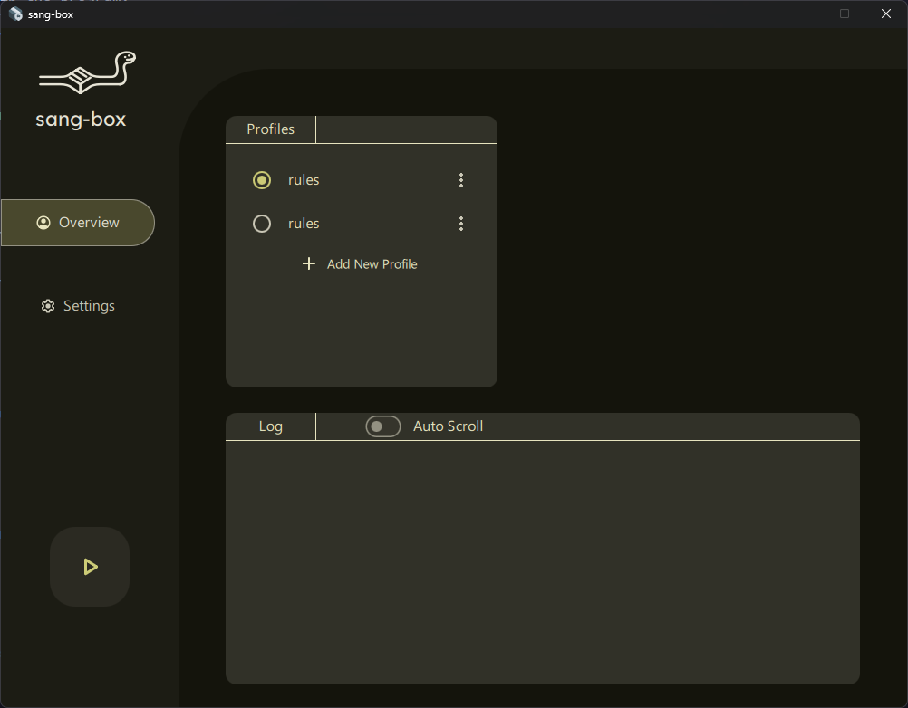
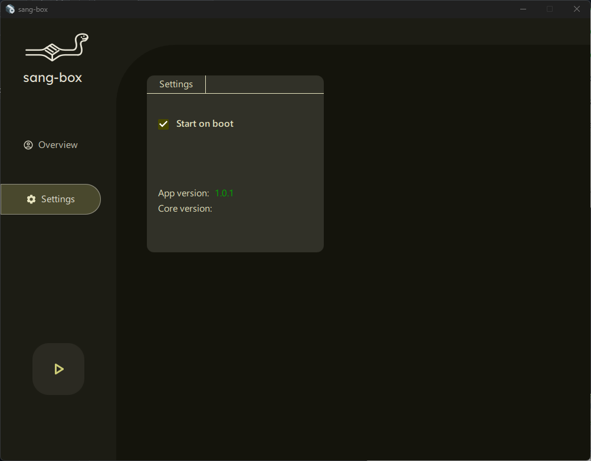

# sang-box

[English](README.md)

GUI-клиент для Windows для [sing-box](https://github.com/SagerNet/sing-box).
Разработан с использованием Qt C++, QML и[QmlMaterial](https://github.com/hypengw/QmlMaterial) .

## Поддерживаемые операционные системы

- Windows 10/11 x64

## How to use

1. Скачайте архив с файлами из[Release](https://github.com/Roker2/sang-box/releases).
2. Установите или распакуйте программу.
3. Импортируйте файл конфигурации. 
4. Запустите прокси.

### Системный прокси

Включите  `set_system_proxy` в файле конфигурации.

```
{
  "inbounds": [
    {
      "type": "http",
      ...
      "set_system_proxy": true
      ...
    }
}
```
### TUN mode

Настройте входящее соединение типа `tun`. В настройках программы включите запуск от имени администратора.

```
{
  "inbounds": [
    {
      "type": "tun",
      ...
    }
}
```

## Как обновить ядро sing-box

Замените `sing-box.exe` в каталоге установки sang-box.

## Скриншоты

### Вкладка «Обзор»

<div align="center">
  
</div>

### Вкладка «Настройки»

<div align="center">
  
</div>

